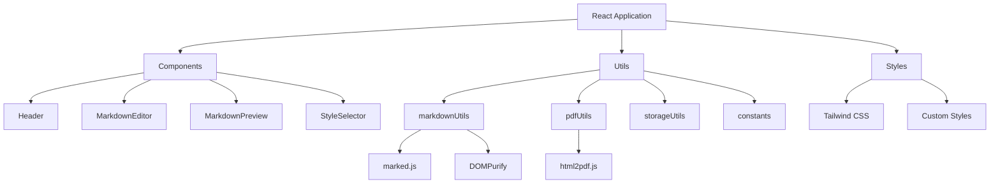

# DraftForge

A powerful, browser-based tool that converts Markdown to beautifully formatted PDFs with real-time preview.

---

## 🌟 Features

- **Real-time Preview**: See your Markdown rendered instantly as you type
- **Multiple PDF Styles**: Choose from various pre-designed templates
  - Default
  - GitHub
  - Academic
  - Elegant
- **GitHub Flavored Markdown**: Full support for GFM syntax
- **Auto-save**: Never lose your work with automatic localStorage backup
- **File Upload**: Import existing Markdown files
- **Responsive Design**: Works seamlessly on desktop and mobile devices
- **Security**: XSS protection with DOMPurify
- **High-Quality PDF Export**: Professional-grade PDF generation

## 🔧 Technology Stack



## 🛠️ Core Components

### Editor Components
- **MarkdownEditor**: Text input area with character count
- **MarkdownPreview**: Real-time rendered preview
- **StyleSelector**: PDF style template chooser
- **Header**: Navigation and action buttons

### Utility Modules
- **markdownUtils**: Markdown processing and HTML conversion
- **pdfUtils**: PDF generation with style configurations
- **storageUtils**: Local storage management
- **constants**: Default content and configurations

## 🎨 Styling System

### Base Styles
- Tailwind CSS for responsive design
- Custom CSS for Markdown preview
- Font families:
  - JetBrains Mono for code
  - Merriweather for content
  - System fonts for UI

### PDF Style Templates
1. **Default**: Clean, professional layout
2. **GitHub**: Familiar GitHub-style formatting
3. **Academic**: Formal academic paper style
4. **Elegant**: Sophisticated typography

## 🔒 Security Features

- HTML sanitization using DOMPurify
- Safe local storage handling
- Error boundary implementation
- Secure PDF generation

## 💾 Storage Implementation

The application uses localStorage for:
- Markdown content persistence
- Style preference saving
- Auto-save functionality

## 📦 Dependencies

```json
{
  "dependencies": {
    "dompurify": "^3.0.9",
    "html2pdf.js": "^0.10.1",
    "lucide-react": "^0.344.0",
    "marked": "^12.0.1",
    "react": "^18.3.1",
    "react-dom": "^18.3.1"
  }
}
```

## 🚀 Getting Started

1. Clone the repository
2. Install dependencies:
   ```bash
   npm install
   ```
3. Start the development server:
   ```bash
   npm run dev
   ```
4. Build for production:
   ```bash
   npm run build
   ```

## 📝 Usage

1. Write or paste Markdown in the left panel
2. Watch the preview update in real-time on the right
3. Select a style template from the bottom toolbar
4. Click "Download PDF" to export your document

## 🤝 Contributing

Contributions are welcome! Please feel free to submit a Pull Request.

## 📄 License

This project is licensed under the MIT License - see the LICENSE file for details.

## 👤 Author

**K Rajtilak**
- GitHub: [@rajtilak-2020](https://github.com/rajtilak-2020)

## 🙏 Acknowledgments

- Icons by [Lucide React](https://lucide.dev)
- Markdown parsing by [Marked](https://marked.js.org)
- PDF generation by [html2pdf.js](https://ekoopmans.github.io/html2pdf.js)

---
© [K Rajtilak](https://krajtilak.vercel.app/). All rights reserved.

---
